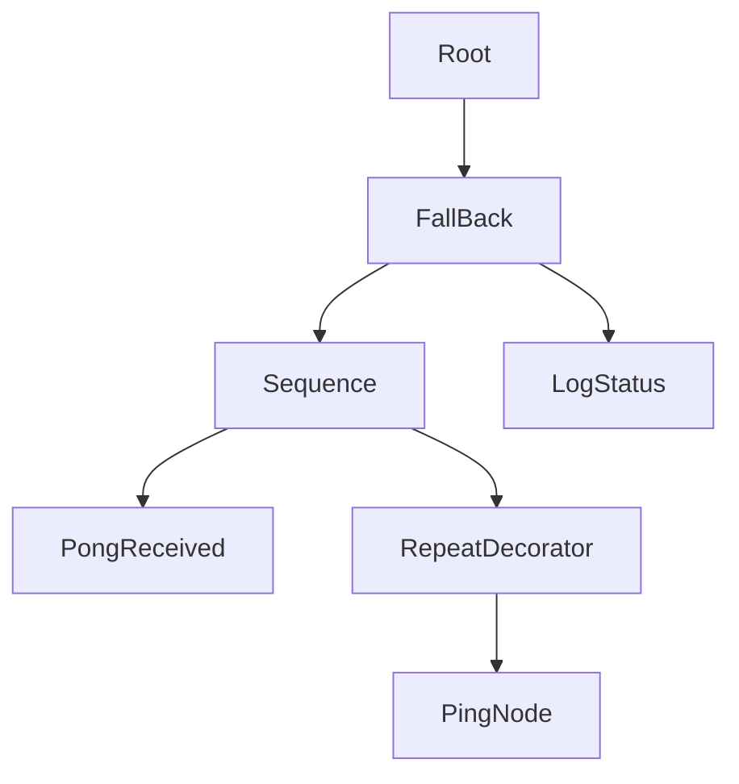
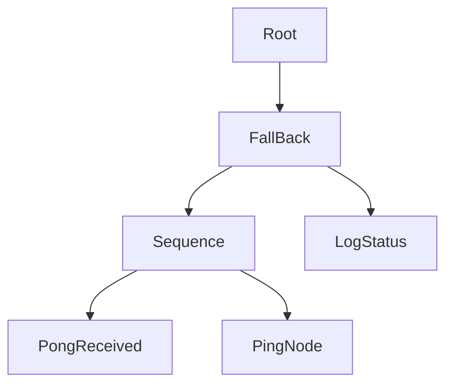
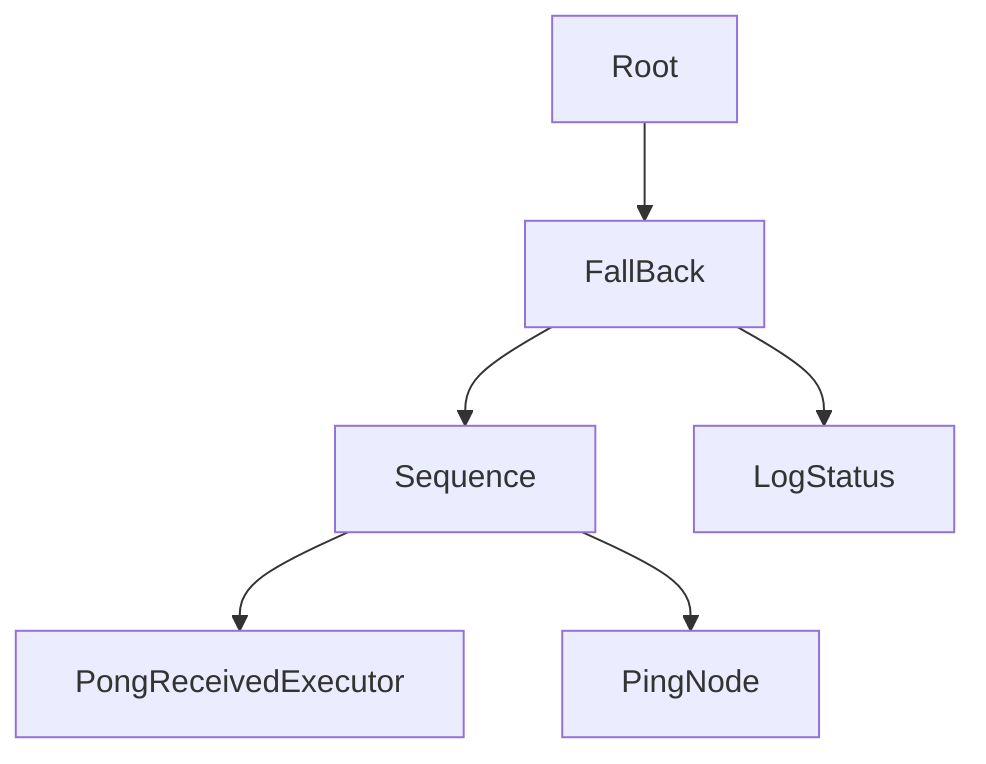

# ros2_behavior_tree_example
Toy example for running a simple behavior tree with ROS2

# Launch Arguments to Launch the Test Nodes
```bash
ros2 launch ros2_behavior_tree_example ping_pong_launch.py -s

    Arguments (pass arguments as '<name>:=<value>'):

        'node1_enable':
            Enable Primary Node in case you want to launch separately. Valid choices are: ['True', 'False']
            (default: 'True')

        'node2_enable':
            Enable Secondary Node in case you want to launch separately. Valid choices are: ['True', 'False']
            (default: 'True')

        'node1_mode':
            Set trees to reactive sequence. Valid choices are: ['sequence', 'reactive_sequence']
            (default: 'reactive_sequence')

        'node2_mode':
            Set trees to standard sequence. Valid choices are: ['sequence', 'reactive_sequence']
            (default: 'sequence')

        'node1_behaviortree':
            Set behevior tree file to use desired nodes. Valid choices are: ['ping_pong.xml', 'ping_pong_no_decorator.xml', 'ping_pong_executor.xml']
            (default: 'ping_pong_executor.xml')

        'node2_behaviortree':
            Set behavior tree file to use desired nodes. Valid choices are: ['ping_pong.xml', 'ping_pong_no_decorator.xml', 'ping_pong_executor.xml']
            (default: 'ping_pong_no_decorator.xml')
```

# Activate the behavior tree nodes
## Primary Node
```bash
> ros2 lifecycle set /primary_ping_pong configure
Transitioning successful

> ros2 lifecycle set /primary_ping_pong activate
Transitioning successful
```

### Secondary Node
```bash
> ros2 lifecycle set /primary_ping_pong configure
Transitioning successful

> ros2 lifecycle set /primary_ping_pong activate
Transitioning successful
```

# General Lifecycle Node Commands
```bash
ros2 lifecycle get /NODE_NAME # returns lifecycle node status
ros2 lifecycle list /NODE_NAME # returns all lifecycles we can transition to
ros2 lifecycle set /NODE_NAME # allows you to set a valid lifecycle from available transitions
```

# Behavior Trees

## Behavior Tree Nodes Used Brief Definitions

### Sequence
Will increment each tick. Will only continue to next if the current one is "Pass". Once it hits an async node that returns running, it will keep calling it until it gets "success" or "failiure". Any "failiure" will make the sequence restart, sequence returns success once all have succeeded.

### Fallback
If the node below returns a failiure, it will switch to the next node in its line. Otherwise it will return Success. If all fallback nodes fail, this will also return fail.

### ReactiveSequence
Similar to a sequence, except when a node is running all nodes prior to it will still be called each tick.

### Repeat
Repeat is a decorator node that will cause the node or tree following it to be repeated a set number of times

## Custom Nodes and Definitions
### PongNode
This node is condition node that implements a ROS subscriber as part of the parent node. It will subscribe and record data.

On tick, if it received data it will return Success and update the received id in it's output port.

### PongNodeExecutor
This node is condition node that implements a ROS subscriber with its own executor. It will subscribe and record data. By default, it will be on the same thread as the executor running in the calling node.

On tick, if it received data it will return Success and update the received id in it's output port.

### PingNode
This is an async action node that implements a ROS publisher that sends out an integer message as a ping. It takes in the number of pings to send and sends them each tick. It records the last ping sent on blackboard.

### LogStatus
This node loginfos the status message defined in its inputport and outputs ping and pong information if set to do so.

## Select Behavior Trees 

### Sequence/ping_pong.xml
This behavior tree utilizes a decorator to make the pong node repeatedly publish.



### Sequence/ping_pong_no_decorator.xml
This behavior tree utilizes the async behavior of the ping node to repeatedly publish



### Sequence/ping_pong_no_decorator.xml
This behavior tree is the same as ping_pong


### Reactive Sequence
All the same behavior trees, however, instead of Sequence we have Reactive Sequence so we always check if we received a pong before shooting out all the pings instead of waiting for pings to complete before checking for a pong.